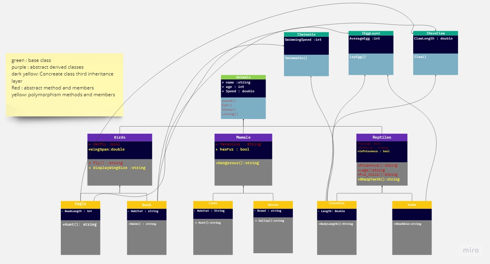

# Zoo

## Introduction 

Our application using a 3 layer of inheritance for zoo which you can clearly see  there is a lot of animals and many parts and each animal has 
own behaivor and properties, in this application we make the behaviours that all animal has and we created 
a unique for each animal and in the zoo you can see a lot of animal family like the lion there is a many 
so each lion has own property. 

## UML Diagram 

## OOP principles 

- the inheritance : we can share some methods and properties form class to class.

    - the `mammals : Animal` here i used inheritance and here too `Lion:Mammals` 
- abstract : insted of create a defenition for the method or the property from the first class i only 
 initilaize it and where i want to use it i can create a definition specific for this class
    
    - in the Mammals class i created the class Abstract and made  the property abstract by adding `Abstract` Keyword 
    in base class too the `Eat(),Sleep()`..etc
- encapsulate : this pricinciple to save the property or the method for the class ony so any instance of this class can't use it or access it 
so to save some informations.
    - by creating a `private` before the init for any members or methods 
    - `private string Habitat { get; set; }` in Lion Class 
    and i used it inside the class in the `Living` abstract method
- polymorphism : it is looks like the abstract you can override it but in poly you can reuse a method that 
 is already exist and has a defienition for the base class for example and you add your own code.
     - ` public virtual Dangerous()` in Mammal class the virtual means it is polymorphism  
     - and used it inside the lion and Horse classes .

# Zoo part2 

- ## Interface : 
    - the interface is a blueprint and can carry methods and members and events can be inhertied
    and inheritance from another Interfaces and class i think im not sure but i remember i read something like this 
    and within interface the classes can inherit from the interfaces and the benift of using 
    interface is to make the class inherit from multi interfaces while it cannot inherit from mmulti classes.

    - i used 3 interfaces one for animal that can layeggs and another one for animal can swim and another one for animals who has Claw
    so for the example the crocodile animal is a reptile and can swim, layeggs and has Claw
    so this class inheritd from 3 interfaces and from the reptile class 
    another classes used the interface (Duck Class, Eagle Class, Snake Class)
    each one of them has own property and the interface was an new method for the animals that has a shared method 
    that not came from same parent, or family.

    - Crocodile inherit from (IEggLayer , IHaveClaw , ISwimable)
    - Snake inherit from (IEggLayer)
    - Duck inherit from (ISwimable , IEggLayer)
    - Eagle inherit from (IHaveClaw , IEggLayer)

    
    #### i hope the uml diagram clear that my best in drawing :smile:
