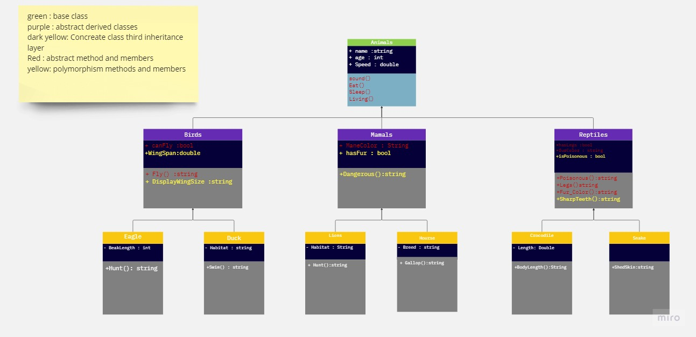

# Zoo

## Introduction 

Our application using a 3 layer of inheritance for zoo which you can clearly see  there is a lot of animals and many parts and each animal has 
own behaivor and properties, in this application we make the behaviours that all animal has and we created 
a unique for each animal and in the zoo you can see a lot of animal family like the lion there is a many 
so each lion has own property. 

## UML Diagram 

## OOP principles 

- the inheritance : we can share some methods and properties form class to class.

    - the `mammals : Animal` here i used inheritance and here too `Lion:Mammals` 
- abstract : insted of create a defenition for the method or the property from the first class i only 
 initilaize it and where i want to use it i can create a definition specific for this class
    
    - in the Mammals class i created the class Abstract and made  the property abstract by adding `Abstract` Keyword 
    in base class too the `Eat(),Sleep()`..etc
- encapsulate : this pricinciple to save the property or the method for the class ony so any instance of this class can't use it or access it 
so to save some informations.
    - by creating a `private` before the init for any members or methods 
    - `private string Habitat { get; set; }` in Lion Class 
    and i used it inside the class in the `Living` abstract method
- polymorphism : it is looks like the abstract you can override it but in poly you can reuse a method that 
 is already exist and has a defienition for the base class for example and you add your own code.
     - ` public virtual Dangerous()` in Mammal class the virtual means it is polymorphism  
     - and used it inside the lion and Horse classes .